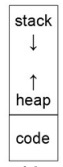

# Explore Memory Layout

---
Author: Ning CAO
Date: Jan 19, 2023

## Q1

Stacks on almost all modern CPUs grow down, using lower memory addresses as more data is pushed onto the stack. The heap refers to memory allocated by malloc() or the C++ or Java new operator. A typical heap allocator will start with a certain amount of memory and allocate more if that runs out.

Consider the following memory layout for a single program running in a fixed address space (here we assume addresses 0000-FFFF are all available to the program, and no others):
auto preview

The program has used up all of its memory space when the middle of the stack and the heap is reached. The stack and heap can no longer grow without overlapping because they have used up all of the memory that was allocated to them. A stack overflow is the term for this occurrence.

A stack overflow can cause the heap and stack to start overwriting each other's memory, which might cause the program to crash or yield unexpected results. Additionally, the software can become unreliable and stop working properly. Security flaws may also result from sensitive data stored in the heap being replaced by stack data.

The application must be created to handle memory allocation effectively and release unused memory in order to prevent a stack overflow. Additionally, the application should be built to manage unforeseen errors and set limits on how much memory can be allocated to the heap and stack.

## Q2

For single-user operating systems without memory protection (e.g., the CSx600, Z80 or Intel 808x) applications are able to make direct function calls to operating system code, yet most operating systems which ran on such computers (e.g., MS-DOS, early MacOS) provided a system call table for making indirect calls into the operating system, and these tables were almost universally used by applications. Describe a reason for using such a table, i.e., a case in which a program calling operating system addresses directly might fail in some cases, while one using the system call table would not.

The system call table is a table composed of function pointers to kernel functions that implement various system calls. This table can be indexed based on the system call number to locate the function address and complete the system call. It can provide a level of abstraction between the application and the operating system.
For instance, if the location of the operating functions change by even the slightest amount (for instance, if new code was added to fix a bug), it would break the programs compiled for the previous version, as calls to the operating system would go to the wrong address.  By adding a layer of indirection, a fixed interface is presented to the program despite changes in the OS.

What is wrong with the following C code fragment? Describe the issue or issues and how you would need to modify to code to avoid any potential problems.

char* block = calloc(2048);
memset(&block, 0xFF, 2048);

1. callos needs two parameters, the number of elements and the size of each element. The code above is missing the size of each element. The code should be changed to char* block = calloc(2048, sizeof(char));. Note that we don't need to cast type of calloc to char* because calloc() returns a pointer to void. And the C language defines an automatic conversion from void* to any other type of pointer.

2. The first parameter of memset() is a pointer to the memory block to fill. The block is already a pointer, so we don't need to take its address. The code should be changed to memset(block, 0xFF, 2048);.

char* block = calloc(2048, sizeof(char));
memset(block, 0xFF, 2048);